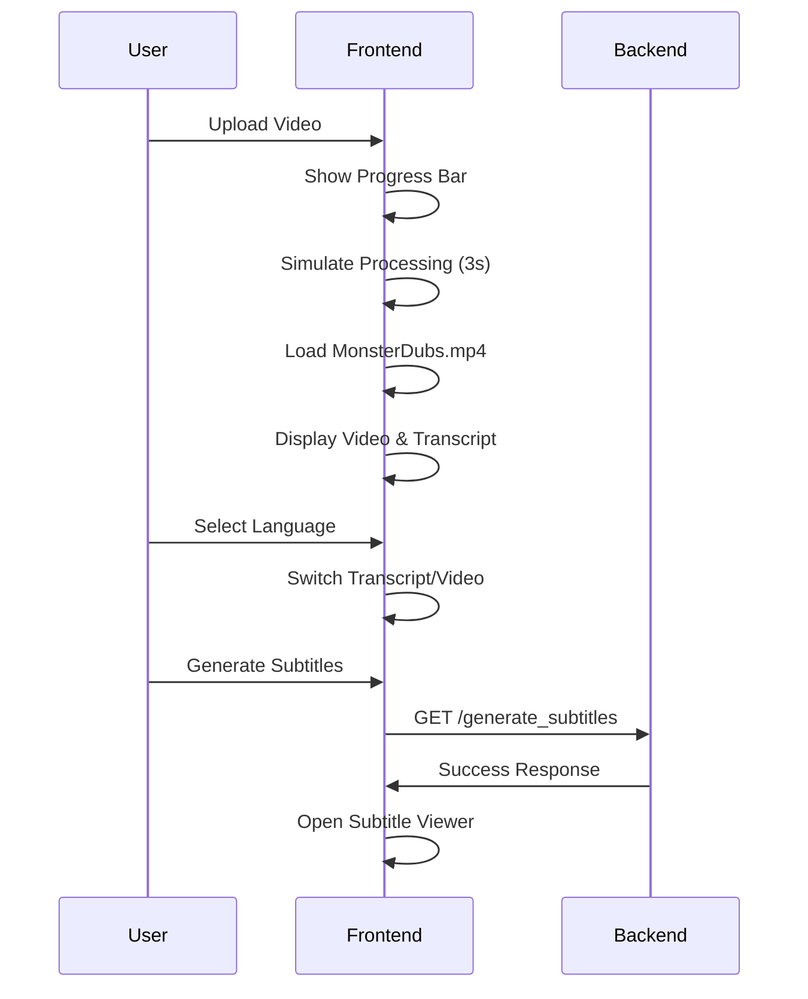

# HTH API Documentation

## 🔌 Backend API Endpoints

### Base URL
```
http://localhost:5000
```

## 📤 Video Upload & Processing

### POST /upload-video
Uploads a video file for processing and transcription.

**Request:**
- **Method**: `POST`
- **Content-Type**: `multipart/form-data`
- **Body**: 
  ```form-data
  video: <video_file>
  ```

**Response:**
```json
{
  "status": "success",
  "transcript": "Video transcript text...",
  "message": "Video uploaded successfully"
}
```

**Error Response:**
```json
{
  "status": "error",
  "message": "Error uploading or transcribing video"
}
```

**Example Usage:**
```javascript
const formData = new FormData();
formData.append("video", file);

const response = await fetch("http://localhost:5000/upload-video", {
  method: "POST",
  body: formData,
});

const data = await response.json();
```

## 🎭 Subtitle Generation

### GET /generate_subtitles
Generates emotion-based subtitles for the uploaded video.

**Request:**
- **Method**: `GET`
- **Parameters**: None

**Response:**
```json
{
  "status": "success",
  "message": "Subtitles generated successfully"
}
```

**Error Response:**
```json
{
  "status": "error",
  "message": "Failed to generate subtitles"
}
```

**Example Usage:**
```javascript
const response = await fetch("http://localhost:5000/generate_subtitles");
const data = await response.json();

if (data.status === "success") {
  window.open("http://localhost:8000", "_blank");
}
```

## 📁 Static File Serving

### GET /subtitles/{filename}
Serves subtitle files, videos, and other static content.

**Request:**
- **Method**: `GET`
- **Path Parameters**: `filename` - Name of the file to serve

**Available Files:**
- `MonsterDubs.mp4` - English dubbed video
- `interactive_subs.json` - Interactive subtitle data
- `subtitles.srt` - Standard subtitle format
- `index.html` - Subtitle viewer interface

**Example Usage:**
```javascript
// Access MonsterDubs video
const videoUrl = "http://localhost:5000/subtitles/MonsterDubs.mp4";

// Access subtitle data
const subtitleUrl = "http://localhost:5000/subtitles/interactive_subs.json";
```

## 🌐 Frontend API Integration

### Video Processing Flow



### State Management

#### Processing.jsx State Variables
```javascript
const [progress, setProgress] = useState(0);
const [transcript, setTranscript] = useState("");
const [videoURL, setVideoURL] = useState("");
const [loading, setLoading] = useState(true);
const [selectedLanguage, setSelectedLanguage] = useState("english");
const [languageTranscripts, setLanguageTranscripts] = useState({});
const [selectedVideoLanguage, setSelectedVideoLanguage] = useState("english");
const [videoLanguages, setVideoLanguages] = useState({
  english: "http://localhost:5000/subtitles/MonsterDubs.mp4",
  hindi: "/videos/MonsterInc_Hindi.mp4",
  tamil: "/videos/MonsterInc_Tamil.mp4",
  malayalam: "/videos/MonsterInc_Malayalam.mp4",
  telugu: "/videos/MonsterInc_Telugu.mp4"
});
```

#### Language Transcripts Structure
```javascript
{
  "english": "English transcript text...",
  "hindi": "Hindi transcript text...",
  "tamil": "Tamil transcript text...",
  "malayalam": "Malayalam transcript text...",
  "telugu": "Telugu transcript text..."
}
```

## 🔧 Configuration

### CORS Settings
```python
# Backend CORS configuration
from flask_cors import CORS

app = Flask(__name__)
CORS(app, origins=["http://localhost:5173"])
```

### File Upload Configuration
```python
# Maximum file size: 100MB
app.config['MAX_CONTENT_LENGTH'] = 100 * 1024 * 1024

# Allowed file extensions
ALLOWED_EXTENSIONS = {'mp4', 'mp3', 'avi', 'mov', 'mkv'}
```

### Port Configuration
```python
# Backend port
if __name__ == "__main__":
    app.run(debug=True, port=5000)
```

```javascript
// Frontend port (vite.config.js)
export default defineConfig({
  server: {
    port: 5173
  }
})
```

## 📊 Data Models

### Video Object
```javascript
{
  name: "MonsterInc.mp4",
  size: 52428800, // bytes
  type: "video/mp4",
  lastModified: 1692000000000
}
```

### Transcript Object
```javascript
{
  language: "english",
  content: "Transcript text...",
  timestamp: "2025-08-14T00:00:00Z"
}
```

### Subtitle Object
```javascript
{
  start: 4.3,
  end: 6.56,
  text: "Subtitle text...",
  emotion: "happy",
  character: "Roz"
}
```

## 🚨 Error Handling

### Frontend Error Handling
```javascript
try {
  const response = await fetch("http://localhost:5000/upload-video", {
    method: "POST",
    body: formData,
  });
  
  if (!response.ok) {
    throw new Error(`HTTP error! status: ${response.status}`);
  }
  
  const data = await response.json();
} catch (error) {
  console.error("Error:", error);
  setTranscript("Error uploading or transcribing video.");
}
```

### Backend Error Handling
```python
@app.errorhandler(413)
def too_large(e):
    return jsonify({"error": "File too large"}), 413

@app.errorhandler(400)
def bad_request(e):
    return jsonify({"error": "Bad request"}), 400

@app.errorhandler(500)
def internal_error(e):
    return jsonify({"error": "Internal server error"}), 500
```

## 🔒 Security Considerations

### File Upload Security
- File type validation
- File size limits
- Secure file storage
- Path traversal prevention

### CORS Configuration
- Restricted origins
- Method restrictions
- Header restrictions

### Input Validation
- File extension validation
- Content type verification
- Malicious file detection

## 📈 Performance Optimization

### Frontend Optimizations
- Lazy loading of video content
- Efficient state management
- Optimized re-renders
- Memory leak prevention

### Backend Optimizations
- Async file processing
- Efficient file handling
- Response caching
- Resource cleanup

## 🧪 Testing

### API Testing
```bash
# Test video upload
curl -X POST -F "video=@test.mp4" http://localhost:5000/upload-video

# Test subtitle generation
curl http://localhost:5000/generate_subtitles

# Test file serving
curl http://localhost:5000/subtitles/MonsterDubs.mp4
```

### Frontend Testing
```bash
# Run tests
npm test

# Run with coverage
npm run test:coverage

# Run e2e tests
npm run test:e2e
```

## 📝 Logging

### Backend Logging
```python
import logging

logging.basicConfig(level=logging.INFO)
logger = logging.getLogger(__name__)

@app.route('/upload-video', methods=['POST'])
def upload_video():
    logger.info("Video upload request received")
    # ... processing logic
    logger.info("Video processing completed")
```

### Frontend Logging
```javascript
// Development logging
if (process.env.NODE_ENV === 'development') {
  console.log('API Response:', data);
  console.log('State Update:', newState);
}
```

## 🔄 Versioning

### API Versioning
- Current Version: v1.0.0
- Backward Compatibility: Maintained
- Deprecation Policy: 6 months notice

### Version Endpoints
```
/v1/upload-video
/v1/generate_subtitles
/v1/subtitles/{filename}
```

---

**Last Updated**: August 2025  
**API Version**: v1.0.0  
**Status**: Production Ready 